# MyGarden

MyGarden merupakan aplikasi game menyiram tanaman dalam aplikasi ini juga terdapat [Widget](https://techijau.com/apa-itu-widget-android/) yaitu sebuah “perwakilan” dari aplikasi yang memungkinkan pengguna untuk ndapat menggunakan fitur dari aplikasi yang diwakilkan tersebut secara langsung tanpa harus membuka aplikasi “sesungguhnya”.

Project ini dipelajari dari Udacity untuk lebih mengetahui lebih dalam [klik disini](https://classroom.udacity.com/courses/ud855/lessons/f133dd92-8e3c-40b9-9d9d-545498638459/concepts/98627458-72ac-45a0-94ff-bca60428ccfc). Sebelumnya pastikan sudah memiliki akun udacity jika tidak memiliki bisa daftar terlebih dahulu.

Terdapat Git dari project ini Untuk selengkapnya [klik disini](https://github.com/udacity/AdvancedAndroid_MyGarden.git)

Pada Udacity Versi android studio berbeda dengan versi android studio yang sekarang. Untuk perubahannya dapat diketahui [disini](https://github.com/udacity/AdvancedAndroid_MyGarden/pull/21/files)

# Hasil dari App MyGarden adalah :

- Tampilan App

Dibawah telah dimunculkan widget untk Android Oppo bisa dengan menarik dari sisi atas dan bawah layar secara bersamaan

Tampilan widget saat belum ada tanaman yang ditambahkan

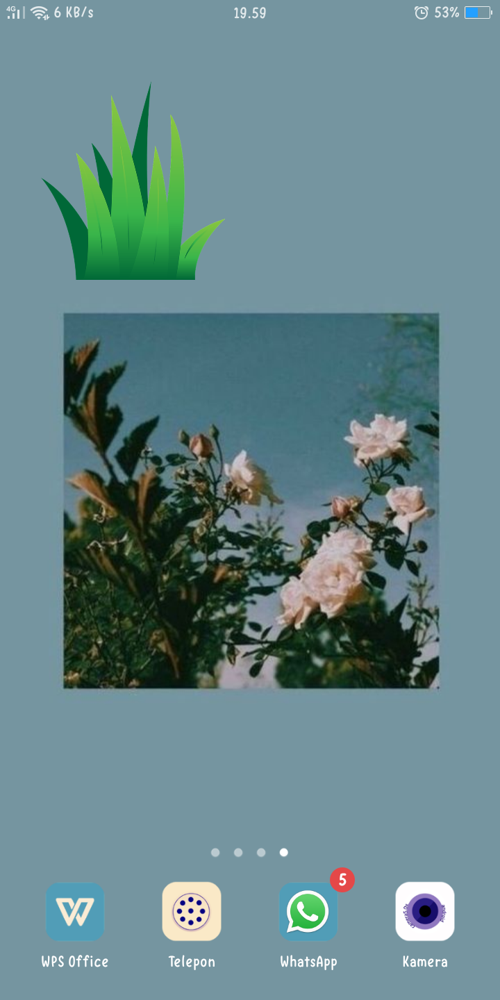 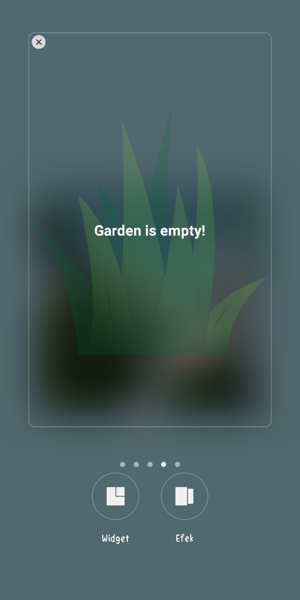

- Mulai masuk App dan menanam tanaman

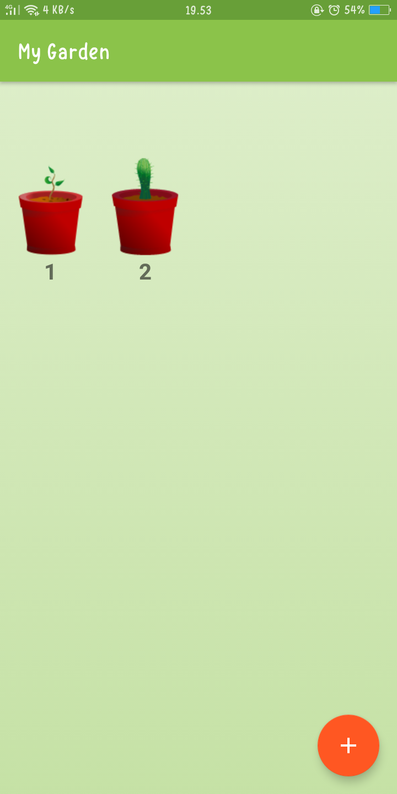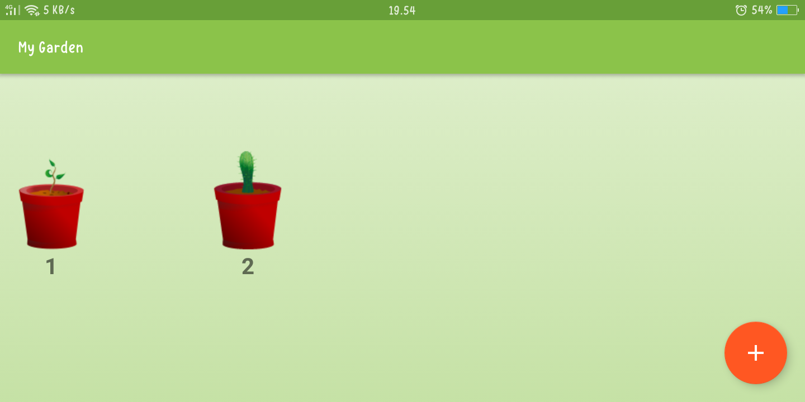

- Memilih jenis tanaman

terdapat button + untuk menambahkan tanaman

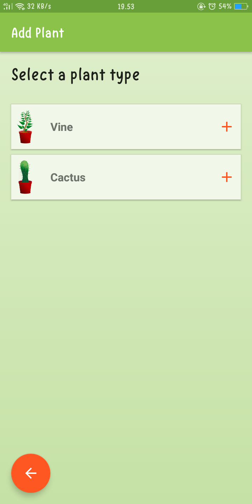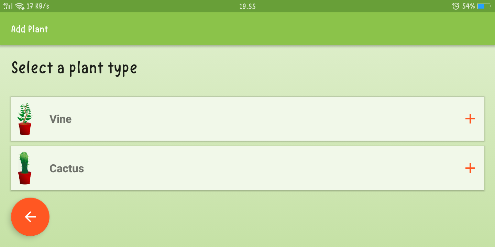

jika telah menambahkan tanaman maka tampilan widget akan berubah seperti berikut :

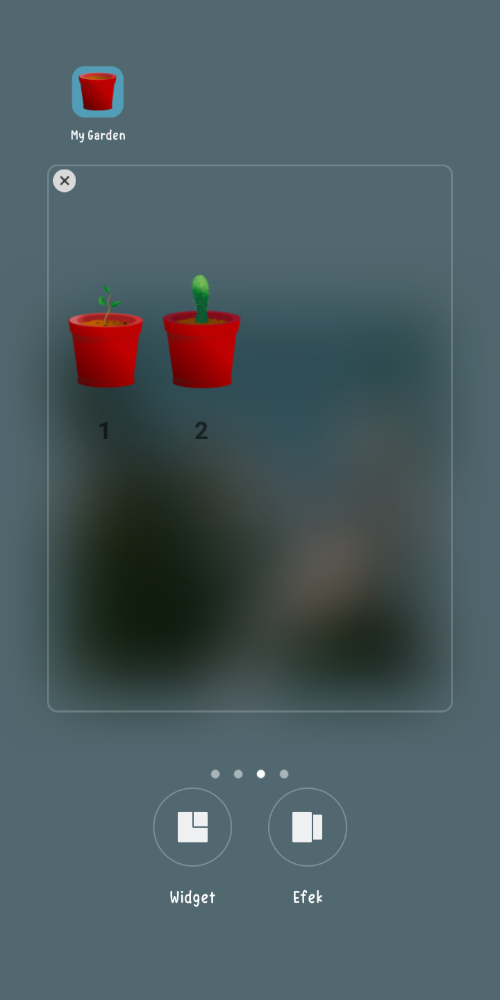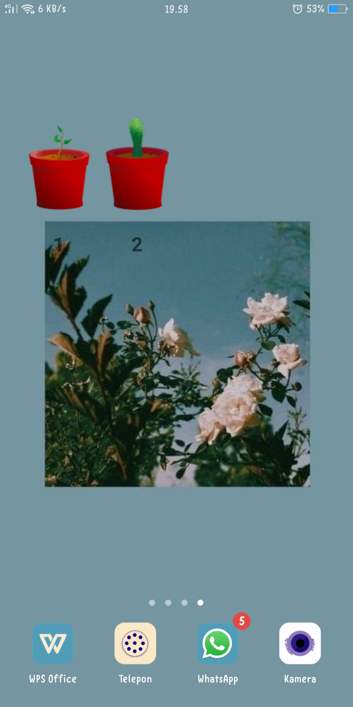

- Detail tanaman sebelum disiram

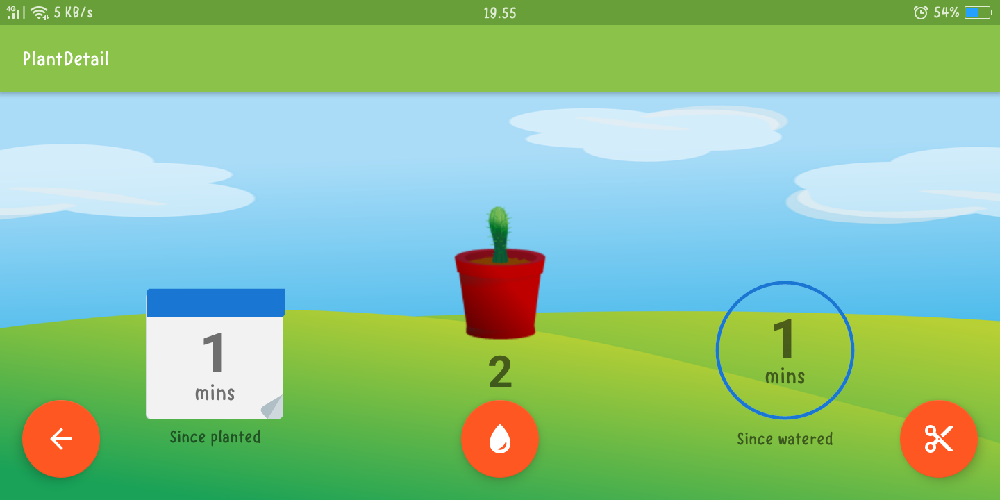

button air di tengah digunakan untuk menyiram tanaman sedangkan button gunting untuk memotong/membuang tanaman

"Since planted" merupakan umur dari tanaman sedangkan "Since watered" merupakan waktu penyiraman

- Detail tanaman setelah disiram

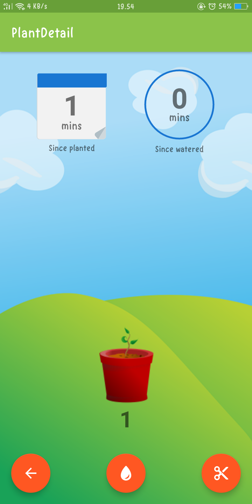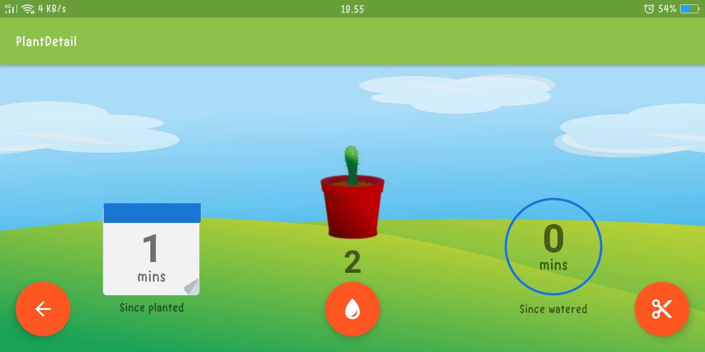

jika tanaman membutuhkan air widget akan berubah seperti berikut

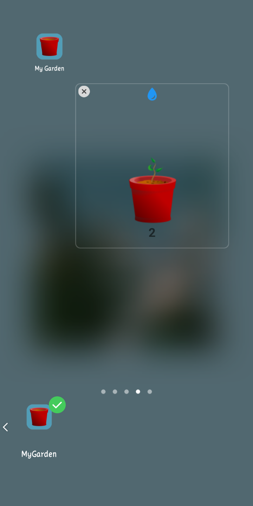

jika tanaman lama tidak disiram maka tanaman bisa layu seperti gambar diatas

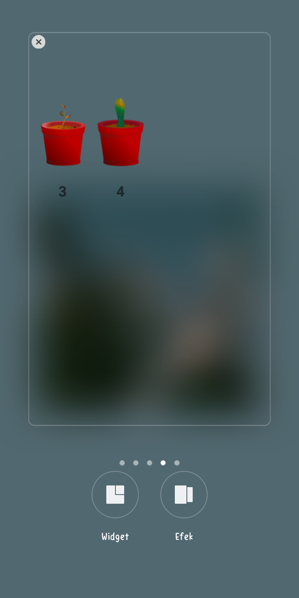

jika tanaman telah disiram maka waktu penyiraman berubah menjadi 0

diatas terdapat gambar versi landscape dan potrait

# Resources gambar

 - [sapling-plant-growing-seedling](https://pixabay.com/vectors/sapling-plant-growing-seedling-154734/)
 
 - [cactus-cacti-plant-thorns-spiky](https://pixabay.com/vectors/cactus-cacti-plant-thorns-spiky-152378/)
 
 - [the-background-background-design](https://pixabay.com/vectors/the-background-background-design-352165/)
 

